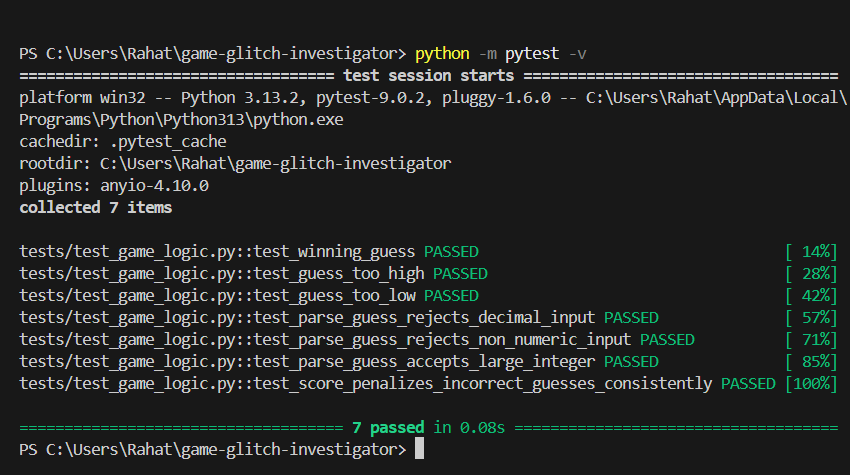

# 🎮 Game Glitch Investigator: The Impossible Guesser

## 🚨 The Situation

You asked an AI to build a simple "Number Guessing Game" using Streamlit.
It wrote the code, ran away, and now the game is unplayable.

- You can't win.
- The hints lie to you.
- The secret number seems to have commitment issues.

## 🛠️ Setup

1. Install dependencies: `pip install -r requirements.txt`
2. Run the broken app: `python -m streamlit run app.py`

## 🕵️‍♂️ Your Mission

1. **Play the game.** Open the "Developer Debug Info" tab in the app to see the secret number. Try to win.
2. **Find the State Bug.** Why does the secret number change every time you click "Submit"? Ask ChatGPT: _"How do I keep a variable from resetting in Streamlit when I click a button?"_
3. **Fix the Logic.** The hints ("Higher/Lower") are wrong. Fix them.
4. **Refactor & Test.** - Move the logic into `logic_utils.py`.
   - Run `pytest` in your terminal.
   - Keep fixing until all tests pass!

## ✅ What Was Fixed

- Refactored logic helpers into `logic_utils.py` and imported them in `app.py`.
- Fixed reversed hint text in `check_guess` (too high now says go lower, too low says go higher).
- Removed mixed string/int secret comparisons that produced inconsistent outcomes.
- Fixed new game reset flow to respect the selected difficulty range.
- Updated UI prompt to display the active range instead of hard-coded `1 to 100`.
- Fixed attempt tracking so attempts only increase on valid in-range guesses.
- Added stricter input validation to reject decimal values and non-numeric guesses.

## 📝 Document Your Experience

- [x] Describe the game's purpose.
- [x] Detail which bugs you found.
- [x] Explain what fixes you applied.

### Game Purpose

The app is a Streamlit number-guessing game where the player picks a difficulty and tries to guess a secret number within a limited number of attempts. The game provides high/low feedback after each guess and updates a score over time.

### Bugs Found

- Hints were reversed, so feedback pointed in the wrong direction.
- Secret comparisons sometimes used strings and numbers together, causing incorrect results.
- New game resets did not honor the selected difficulty range.
- The guess prompt displayed a hard-coded range that did not always match actual settings.

### Verification

- Ran `pytest` and confirmed all tests pass (`7 passed`).
- Added edge-case tests for decimal input, non-numeric input, and very large numeric input.
- Confirmed score behavior is consistent for incorrect guesses.

## 📸 Demo

- [x] **Winning Game with Challenge 4 UI**
      

- [x] **Pytest Results (7 Tests Passing)**
      

## 🚀 Stretch Features

- [x] Challenge 1: Advanced Edge-Case Testing
- [x] Challenge 4: Enhanced Game UI

### Challenge 1 Notes

Added targeted edge-case tests to verify that the game logic handles unusual input gracefully:

- Decimal input (`"12.5"`) is rejected with a clear message.
- Non-numeric input (`"abc"`) is rejected with a clear message.
- Extremely large integer input (`"999999"`) is parsed predictably at the logic layer.

### Challenge 4: Enhanced Game UI ✨

Implemented a professional, user-friendly game interface with:

**Win Feedback:**

- Trophy emoji (🏆) and prominent green success message
- Display of attempts used, difficulty, and final score
- Balloons animation on win

**Loss Feedback:**

- Skull emoji (💀) and prominent red error message
- Shows the secret number and how many attempts were used

**Hot/Cold Indicator:**

- `calculate_distance()` function computes how far the guess is from the secret (0-100%)
- `get_temperature_emoji()` returns temperature-based feedback:
  - 🔥 PERFECT (exact match)
  - 🌡️ SCORCHING (within 5)
  - 🔥 HOT (within 15)
  - 🌤️ WARM (within 30)
  - ❄️ COOL (within 50)
  - 🧊 FREEZING (far away)
- Visual progress bar showing proximity to the secret

**Guess History Table:**

- `pandas` DataFrame showing all previous guesses with:
  - Attempt number
  - Guess value
  - Feedback (Too High / Too Low)
  - Temperature emoji
  - Distance percentage
- Table updates after each guess for easy tracking

**Visual Improvements:**

- Color-coded error messages for Too High / Too Low feedback
- Progress bar for distance visualization
- Divider separating gameplay from history
- Better formatting with bold text and emojis for clarity
